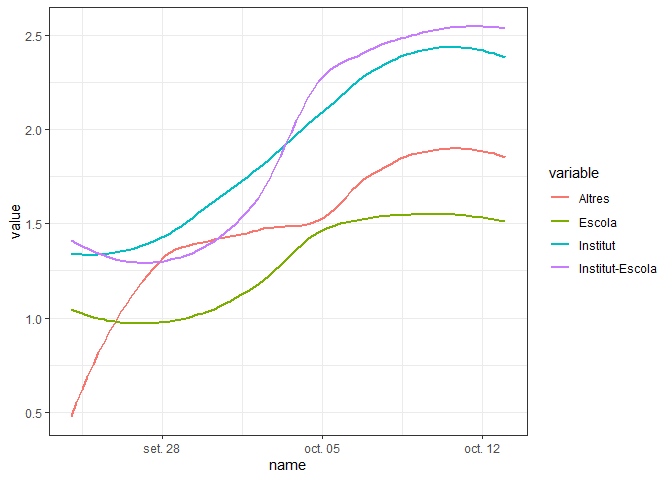
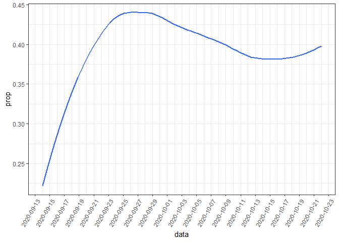

Càlcul *ρ*0 intra centre
===================================

En aquest apartat mirem, després de que aparegui un cas en una classe,
quants altres n’apareixen, que assumim que són contagis d’aquest primer.
Això és una assumpció que serà violada aleatòriament, però creiem que no
tindrà molt d’efecte, ja que, com es pot veure en els càlculs de
probabilitats dels mapes, les probabilitats de que hi hagi dos casos
independents dins d’una mateixa classe són molt petites.

Assumim que els infants i adolescents poden ser contagiosos durant 14
dies després d’emmalaltir. Això és equivalent a 10 dies laborables, que
és en el format que tenim les dades.

*Nota:* potser s’haurà de fer alguna correcció pels festius.

Ara fem el càlcul de a quantes persones contagia cada alumne. Per
fer-ho, però, hem de primer fer assumpcions sobre com d’estancs són els
grups bombolla. El rang va de que hi ha 0 transmissió entre grups, és a
dir, que cada cas en un altre grup confinat és un cas independent, fins
a 1, que vol dir que no hi ha bombolles i que tots els casos d’una
escola provenen del mateix cas índex. Evidentment la realitat marginal
estarà en algun lloc de per aquí al mig, així que per ara fem un
paràmetre per controlar aquest valor i ja mirarem d’ajustar-lo.

Fem un primer anàlisi amb aquest valor a 0.2, és a dir, que un 20% dels
contagis fora del grup classe són culpa de contagis entre grups
bombolla.

Fem un primer anàlisi ajuntant alumnes i mestres:

Fem la mitjana:

Classifiquem els centres escolars en guarderies, escoles, instituts,
escola-institut o altres.

*Nota:* traiem les guarderies a partir d’ara perquè es comporten de
forma molt estranya.

Sense tants sotracs:

Així doncs, veiem que la rho 0 s’ha trobat per sobre d’1 durant gairebé
tot el període, sent especialment preocupant en els instituts i els
instituts escola, on, encara que les bombolles s’haguessin matingut,
arribem a valors per sobre del 2 aquests últims dies.

Model SIR
=========

Ajustem un model SIR al nombre de casos per tal de trobar aquesta rho 0
de forma teòrica:

Dibuixem tots:

Fixem-nos que totes les corbes són inicis d’exponencials, que ja ens fa
pensar que anem ben encaminats amb models SIR.

Fem el cas dels alumnes, que és segurament el més robust en tenir tants
casos:

Aquest gràfic ens mostra que el ritme de contagis és l’esperable en un
model SIR amb *ρ*0 = 1.275. Aquest és un model
sobre-simplificat perquè sabem que la rho ha estat pujant aquests últims
dies. A més, amb només aquesta informació no sabem si els contagis són
dins de l’escola o simplement reflecteixen la *ρ*0 de fora de
la població general. En tot cas, sí que mostra que la *ρ*0
efectiva a les escoles sempre ha sigut més alta que la reportada per la
població general, per tant podem afirmar que aquestes han estat actuant
com a acceledores de la pandèmia. Si són les acceledarores principals o
no, ho intentarem esbrinar en el següent apartat.

Abans, però, notem que el valor màxim d’aquesta corba projectada és
2.746110^{4}, que serien el nombre d’infants i adolescents que es
contagiarien segons aquest model. Segons aquest model, el màxim seria el
dia 2020-10-28. Hem de tenir en compte que aquí es nota força que les
dades són de 10 dies enrere, i per tant aquest model segurament
evolucioni amb el temps.

Rho escoles en relació a la rho total
=====================================

Per acabar, mirem quin percentatge de la *ρ*0 total és causat
per les escoles. Per fer-ho, compararem el valor escolar que hem mesurat
prèviament amb el valor poblacional que calculem a partir de les dades
poblacionals. Noteu que els càlculs de la *ρ*0 dins de les
escoles i a la població són diferents per raons òbvies, però assumirem
que es poden comparar.

Dibuixem tots:

Aquí veiem clarament com les escoles tenen una *ρ*0 molt
semblant a la població, és a dir, que poden ser casos importants, però
en canvi els instituts estan molt per sobre, arribant fins i tot al
doble de la rho poblacional.

Inferim causes
--------------

Aquí volem veure quina part de la rho poblacional és causa de la rho
dels centres educatius i quina és causa d’altres factors. Aquest apartat
té dues limitacions molt evidents: la primera, que hi ha molts contagis
entre infants i adolescents que passen amb els grups bombolla, però no
dins de l’escola. Això és especialment així amb els adolescents. De
totes maneres, assumim que, si el centre escolar estés tancat, aquestes
trobades també es reduirien. Per altra banda, no estem mesurant ni
tenint en compte els contagis des dels nens i adolescents cap a persones
del seu entorn que no són del seu grup bombolla. En particular, és
important el contagi cap a la seva família. Les dues limitacions van en
direccions oposades, així que assumim que aproximadament es cancel·len
entre elles.

Fem un gràfic de la proporció:

Es veu clarament la pujada de la proporció de casos respecte del total a
principi de curs i després es manté més o menys constant, tot i que
potser amb una petita reducció els últims dies.

Ara imaginem que la *ρ*0 a les escoles fos 0 (cosa que no
seria certa perquè també hi estem entrant casos que provenen de fora,
però només per fer l’exercici teòric), mirem com seria la nova
*ρ*0 poblacional. L’equació que les lliga és:

$$ \\rho\_T = \\frac{\\rho\_E \\cdot r + \\rho\_P}{1 + r} $$
, o, aïllant *ρ**P*, que és la que ens interessa ara:

*ρ**P* = (1 + *r*)*ρ**T* − *r**ρ**E*
, on

*ρ**T* és la *ρ* total,

*ρ**P* és la *ρ* poblacional,

*ρ**E* és la *ρ* a les escoles i

$$ r = \\frac{casos\\;escoles}{casos\\;totals} $$
és la fracció entre els casos a les escoles i els totals.

Hem de tenir en compte que la proporció que tenim és de 0 a 20 anys i
nosaltres necessitem la de 5 a 18 (aproximadament), per fer-ho, com a
primera aproximació, simplement dividim per 20 i multipliquem per 14.

Dibuixem ara tot junt:

Aquí veiem, doncs, que tancant els centres escolars podríem reduir la
*ρ*0 uns 0.15 punts, amb dades de fa 10 dies.

Si considerem tancar només els instituts:

Veiem que tancar els insituts ja baixaria la *ρ*0 uns 0.12
punts ella sola, així que tindria sentit només tancar aquests, insistim,
amb dades de fa 10 dies.

Si dibuixem la contribució relativa de les escoles i la població (alerta
perquè la rho no és aditiva, així que aquests valors no tenen una
traducció directa a percentatges):

Només amb instituts:

Conclusions
===========

Efecte notable però no determinant
----------------------------------

L’efecte dels centres escolars en la pandèmia ha sigut notable,
incrementant la rho mitjana de Catalunya en entre 0.05 i 0.21 punts al
llarg del mes que han estat obertes; incrementant-se aquest valor els
últims dies. No tenim les *ρ*s causades per altres causes, però creiem
que aquests valors dels centres escolars no són els que afecten més a la
*ρ* total. Aquests valors segurament varien molt entre regions, ja que
n’hi ha que tenen molta més incidència que altres, per en aquest primer
estudi ho ajuntem tot.

Aquí també tenim una limitació notable, que és que no sabem exactament
quin ha sigut el valor de la transmissió entre bombolles. Els resultats
són força depenents d’aquest factor (les rhos respectives es poden
multiplicar fins a per 2.5) i necessitaríem més dades per poder ajustar
millor els valors.

Escola vs Institut
------------------

En aquest anàlisi confirmem allò que ja hem estat veient aquests dies,
amb dades per exemple provinents d’Isreal, que les escoles **no** es
comporten com focus significatiu de contagis, però en canvi els
instituts **sí**. És per això que creiem que una actuació molt clarament
necessària a curt termini és eliminar la presencialitat en tots els
estudis per a majors de 12 anys. En canvi, si durant els propers dies no
canvia la tendència de les escoles, aquestes podrien mantenir-se
obertes, com a mínim en aquelles zones on la incidència no sigui
aclaparadora.
